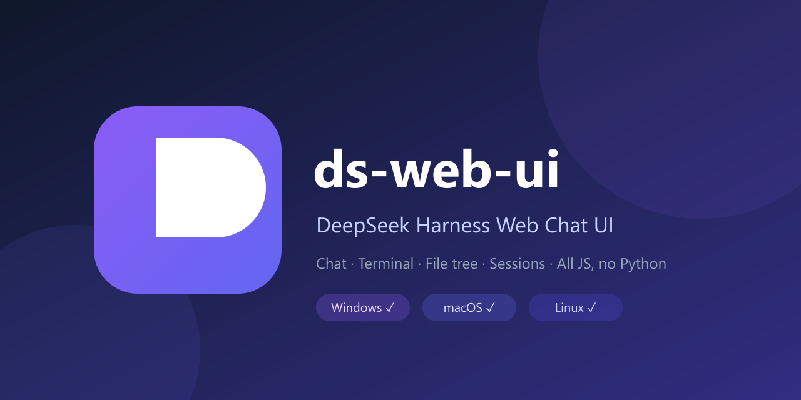

# ds-web-ui

<div align="center">



</div>

**简体中文** | [English](https://github.com/xing-shuyin/ds-web-ui/blob/master/README.en.md)

## 简介

为 [DeepSeek Harness (DSH)](https://github.com/deepseek-ai/deepseek-harness) 打造的 Web 聊天界面 —— agent 通过官方 DSH stdio JSON-RPC runtime（纯 Node，随包自带）在子进程中执行，事件经 WebSocket 流式推送到浏览器。界面从 [pi-web-ui](https://github.com/xing-shuyin/pi-web-ui) 忠实移植。

- 思考块与工具调用，流式输出
- 附件上传与文件浏览
- 内置终端（xterm.js + node-pty）
- 多对话并行、会话管理与模型切换
- 状态栏：token 统计 / 1M 上下文窗口 / 花费估算

需要 **Node.js ≥ 22.19** 和一个有效的 **DeepSeek API key**。

## 安装

```bash
npm i -g ds-web-ui            # 全局安装（推荐）
npx --yes ds-web-ui           # 或免安装直接运行（最新版，默认 :8989）
npm i -g .                    # 或安装本地源码
```

## 使用

### 启动

```bash
ds-web-ui                                  # 前台运行，http://localhost:8989
ds-web-ui --port 9099                      # 指定端口
DS_WEB_CWD=/path/to/project ds-web-ui      # 指定工作区
```

端口优先级：`--port` 参数 > `DS_WEB_PORT` > `PORT` > 8989。API key 通过 `DEEPSEEK_API_KEY` 环境变量、`~/.ds-web/dsh-key.json` 或自动复用 `~/.pi/agent/auth.json` 提供。

### 停止

- **前台**：在运行它的终端按 `Ctrl+C`。

### 更新

```bash
npm i -g ds-web-ui@latest     # 升级到最新发布版本
```

### 卸载

```bash
npm uninstall -g ds-web-ui
```

卸载**不会**删除你的聊天记录 —— 会话数据保存在 `~/.ds-web`（或 `DS_WEB_DATA_DIR`），卸载/升级后依然保留。

### 作为系统服务运行（开机自启）

ds-web-ui 暂无内置的 server 子命令，推荐用 [pm2](https://pm2.keymetrics.io/) 管理（跨平台，Windows / macOS / Linux 通用）：

```bash
npm i -g pm2
pm2 start ds-web-ui --name ds-web-ui -- --port 9000    # 启动
pm2 save                                                # 保存进程列表
pm2 startup                                            # 配置开机自启（按提示执行命令）
pm2 status / pm2 logs ds-web-ui / pm2 restart ds-web-ui
```

如需自定义端口或工作区：`pm2 start ds-web-ui -- --port 9000`、`pm2 start ds-web-ui -- --port 9099 --cwd /path/to/project`（`DS_WEB_CWD` 也可用环境变量传入）。Linux 也可以用 systemd，macOS 用 launchd，Windows 用任务计划程序。

## License

MIT